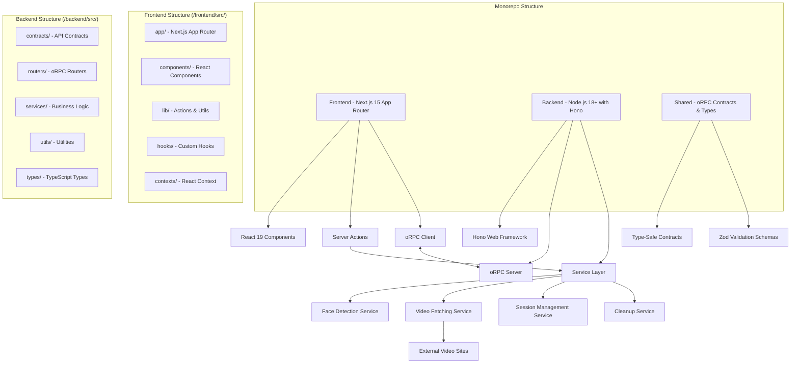

# Design Document

## Overview

The Face Video Search application is a full-stack monorepo application that enables users to upload facial images and find similar-looking individuals in videos from predefined websites. The system uses modern face recognition technology to generate facial embeddings and perform similarity matching against video thumbnails.

The application follows a monorepo architecture with separate frontend (Next.js 15 App Router) and backend (Node.js 18+ with Hono) applications, connected via oRPC for type-safe API communication. This design ensures end-to-end TypeScript type safety, optimal performance, and maintainable code organization following established steering patterns.

## Architecture



## Components and Interfaces

### Frontend Components

#### ImageUpload Component (`/frontend/src/components/FaceUpload.tsx`)

- **Purpose**: Handle image file selection, validation, and upload following frontend-expert.md patterns
- **Architecture**: Function declaration component with proper hook ordering and event handlers
- **Props**: Type-safe interfaces with proper TypeScript definitions
- **State Management**: React hooks in proper order (data fetching, logic, primitives, constants, computed values)
- **Event Handlers**: Use "handle" prefix (handleFaceUpload, handleFileValidation)
- **Features**: React Dropzone integration, image preview, file validation with proper error boundaries
- **UI Components**: shadcn/ui Card, Button, Alert components with Tailwind CSS styling
- **Constants**: ALL_CAPS globals (MAX_FILE_SIZE, ACCEPTED_TYPES)
- **Error Handling**: Comprehensive error boundary patterns with user-friendly messaging

#### SearchResults Component (`/frontend/src/components/SearchResults.tsx`)

- **Purpose**: Display matching videos with thumbnails and metadata following performance optimization patterns
- **Architecture**: Function declaration with proper component structure from frontend-expert.md
- **Props**: Type-safe interfaces with VideoMatch[] arrays and proper error handling
- **State Management**: React hooks in correct order with computed/derived values using useMemo
- **Performance**: Virtualized results grid using react-window for large datasets
- **Features**: Responsive grid layout, similarity score visualization, external link handling
- **UI Components**: shadcn/ui Card, Badge, Button, Progress, and Grid components with accessibility
- **Event Handlers**: Proper naming conventions (handleResultClick, handleThresholdChange)
- **Optimization**: Image lazy loading, virtual scrolling, and proper caching strategies

#### LoadingSpinner Component (`/frontend/src/components/ui/LoadingSpinner.tsx`)

- **Purpose**: Show processing status and progress indicators with comprehensive error handling
- **Architecture**: Function declaration following frontend-expert.md component patterns
- **Props**: Type-safe interfaces with proper TypeScript definitions for message and progress
- **Features**: Animated spinner, progress bar, status messages with accessibility (ARIA labels)
- **UI Components**: shadcn/ui Spinner, Progress, Alert components with proper semantic HTML
- **Error Boundary**: FaceSearchErrorBoundary integration for graceful error handling
- **Accessibility**: Proper ARIA labels, keyboard navigation, and screen reader support

### API Architecture

#### Server Actions (`/frontend/src/lib/actions.ts`)

##### detectFaces Server Action

- **Purpose**: Accept image upload and initiate face recognition using Next.js 15 server actions
- **Architecture**: Type-safe server actions with proper error handling and validation
- **Request**: FormData with image file, validated using Zod schemas
- **Response**: Type-safe response with success/error states following oRPC patterns
- **Processing**: File validation, face detection, embedding generation with proper cleanup
- **Integration**: Uses backend oRPC services for face processing with type safety

#### oRPC with Hono Backend (`/backend/src/`)

##### Face Processing Router (`/backend/src/routers/faceRouter.ts`)

- **Purpose**: Handle face detection and embedding generation with type-safe oRPC contracts
- **Architecture**: oRPC server with Hono provider following backend service layer patterns
- **Contracts**: Type-safe contracts defined in `/backend/src/contracts/api.ts` with Zod validation
- **Services**: Delegates to `/backend/src/services/faceDetectionService.ts` for business logic
- **Error Handling**: Comprehensive error handling with proper TypeScript error types
- **Features**: Type-safe image processing pipeline with automatic cleanup

##### Video Search Router (`/backend/src/routers/videoRouter.ts`)

- **Purpose**: Fetch and process videos from predefined websites with parallel processing
- **Architecture**: Service layer pattern with proper separation of concerns
- **Services**: Uses `/backend/src/services/videoFetchingService.ts` for scraping logic
- **Features**: Parallel processing, rate limiting, error handling, progress tracking
- **Validation**: Zod schemas for request/response validation with runtime type checking

##### Session Management Router (`/backend/src/routers/sessionRouter.ts`)

- **Purpose**: Manage search sessions with automatic cleanup and privacy protection
- **Architecture**: Service layer with `/backend/src/services/sessionService.ts`
- **Features**: Session expiration, data purging, temporary storage management
- **Privacy**: Automatic cleanup following privacy-first design principles

### File Organization

Following the monorepo structure from structure.md:

#### Frontend Structure (`/frontend/src/`)

```
frontend/src/
├── app/                    # Next.js 15 App Router pages
│   ├── layout.tsx         # Root layout component
│   ├── page.tsx           # Main application page
│   └── globals.css        # Global Tailwind CSS styles
├── components/            # React components
│   ├── ui/               # shadcn/ui components (Button, Card, Alert, etc.)
│   ├── FaceUpload.tsx    # Face upload component
│   ├── SearchResults.tsx # Search results display
│   └── LoadingSpinner.tsx # Loading and error states
├── lib/                  # Utilities and configurations
│   ├── actions.ts        # Next.js 15 server actions
│   ├── api-config.ts     # oRPC client configuration
│   └── utils.ts          # General utility functions
├── hooks/                # Custom React hooks
│   └── useImageProcessor.ts # Image processing hook
├── contexts/             # React context providers
│   └── SessionProvider.tsx # Search session management
└── test/                 # Test setup and utilities
    └── setup.ts          # Vitest configuration
```

#### Backend Structure (`/backend/src/`)

```
backend/src/
├── contracts/            # oRPC API contracts
│   └── api.ts           # Zod schemas and TypeScript types
├── routers/             # oRPC route handlers
│   ├── faceRouter.ts    # Face processing endpoints
│   ├── videoRouter.ts   # Video search endpoints
│   └── sessionRouter.ts # Session management
├── services/            # Business logic services
│   ├── faceDetectionService.ts # Face recognition logic
│   ├── videoFetchingService.ts # Video scraping logic
│   ├── sessionService.ts       # Session management
│   └── cleanupService.ts       # Privacy and cleanup
├── utils/               # Utility functions
│   └── validation.ts    # Zod validation helpers
├── types/               # TypeScript type definitions
│   └── index.ts         # Shared type exports
└── __tests__/           # Jest test files
    └── services/        # Service layer tests
```

### Data Models

#### VideoMatch Interface

```typescript
interface VideoMatch {
  id: string
  title: string
  thumbnailUrl: string
  videoUrl: string
  sourceWebsite: string
  similarityScore: number
  detectedFaces: FaceDetection[]
}
```

#### FaceDetection Interface

```typescript
interface FaceDetection {
  boundingBox: {
    x: number
    y: number
    width: number
    height: number
  }
  embedding: number[]
  confidence: number
}
```

#### SearchSession Interface

```typescript
interface SearchSession {
  id: string
  userImagePath: string
  userFaceEmbedding: number[]
  status: "processing" | "completed" | "error"
  results: VideoMatch[]
  threshold: number
  createdAt: Date
  expiresAt: Date
}
```

## Technology Stack

### Monorepo Architecture

- **Structure**: Single repository containing both frontend and backend applications
- **Type Safety**: End-to-end TypeScript with shared type contracts
- **Communication**: oRPC for type-safe API communication between frontend and backend

### Frontend Stack (`/frontend/`)

- **Framework**: Next.js 15 with App Router and React 19
- **Runtime**: Node.js 18+ with ESM modules
- **UI Library**: React 19 with TypeScript strict type checking
- **Styling**: Tailwind CSS with Tailwind Animate
- **Components**: Radix UI primitives with shadcn/ui component library
- **API Client**: oRPC client for type-safe backend communication
- **File Upload**: React Dropzone with proper validation and error handling
- **Testing**: Vitest with jsdom environment for component testing
- **State Management**: React Context for global state, oRPC for server state

### Backend Stack (`/backend/`)

- **Runtime**: Node.js 18+ with ESM modules
- **Framework**: Hono (fast, lightweight web framework)
- **RPC**: oRPC server for type-safe API endpoints
- **Validation**: Zod schemas for runtime type validation and API contracts
- **Face Recognition**: face-api.js with Canvas polyfills for Node.js environment
- **Image Processing**: Sharp for image manipulation and thumbnail generation
- **Web Scraping**: Puppeteer and Cheerio for video fetching and metadata extraction
- **Testing**: Jest with ts-jest for ESM support and service layer testing

### Development Tools

- **TypeScript**: Strict type checking across entire monorepo stack
- **Build**: Native TypeScript compiler (tsc) for both applications
- **Dev Server**: tsx watch for backend development, Next.js dev for frontend
- **Process Management**: Concurrently for running multiple development processes
- **Type Checking**: Separate type checking commands for frontend and backend

### Face Recognition Technology

- **Primary Library**: face-api.js with pre-trained models for Node.js
- **Models**: SSD MobileNet for detection, FaceNet for recognition embeddings
- **Embedding Size**: 128 dimensions for optimal accuracy and performance
- **Distance Metric**: Cosine similarity for face comparison and matching
- **Canvas Support**: Canvas polyfills for server-side image processing

## Architecture Decisions

### UI Component Library Selection

**Decision**: Use shadcn/ui with Radix UI primitives as the primary component library
**Rationale**:

- **Accessibility First**: Built on Radix UI primitives with ARIA labels, keyboard navigation, and screen reader support
- **Type Safety**: TypeScript-first components with excellent type inference and safety
- **Customization**: Copy-paste approach allows full customization without bundle bloat
- **Design System**: Consistent design system with Tailwind CSS integration
- **Performance**: Tree-shakable components with minimal runtime overhead
- **Developer Experience**: Excellent documentation and community support
- **Next.js Integration**: Perfect compatibility with App Router and React Server Components
- **Steering Alignment**: Matches frontend-expert.md component patterns and accessibility guidelines

### Face Recognition Library Selection

**Decision**: Use face-api.js with Canvas polyfills for Node.js backend processing
**Rationale**:

- **Cross-Platform**: Supports both browser and Node.js environments with proper polyfills
- **Pre-trained Models**: Includes SSD MobileNet for detection and FaceNet for recognition
- **Performance**: Good balance between accuracy and processing speed for real-time applications
- **Documentation**: Well-documented API with extensive examples and community support
- **Integration**: Works seamlessly with Sharp for image processing and Canvas for server-side rendering
- **Embedding Quality**: Generates high-quality 128-dimension embeddings for accurate similarity matching
- **Maintenance**: Actively maintained with regular updates and security patches

### Monorepo Architecture Selection

**Decision**: Use monorepo structure with separate Next.js 15 frontend and Node.js 18+ backend
**Rationale**:

- **Type Safety**: End-to-end TypeScript with shared oRPC contracts and Zod validation
- **Separation of Concerns**: Clear boundaries between frontend UI and backend business logic
- **Scalability**: Independent scaling and deployment of frontend and backend services
- **Development Experience**: Specialized tooling for each application (Vitest for frontend, Jest for backend)
- **Performance**: Optimized builds using native TypeScript compiler for both applications
- **Flexibility**: Can deploy frontend and backend to different platforms if needed
- **Team Collaboration**: Clear ownership boundaries and specialized development workflows

### API Architecture Selection

**Decision**: Use oRPC with Hono for extended backend functionality
**Rationale**:

- Type-safe client-server communication with automatic TypeScript inference
- Hono provides lightweight, fast web framework capabilities
- Better separation of concerns for complex business logic
- Improved developer experience with end-to-end type safety
- Flexible routing and middleware support
- Compatible with serverless and edge runtime environments

### Temporary Storage Strategy

**Decision**: Use in-memory storage with file system cleanup (or serverless-compatible storage)
**Rationale**:

- Ensures privacy by not persisting user data
- Simple implementation without database dependencies
- Automatic cleanup through TTL and cron jobs
- Compatible with serverless deployment (Vercel, Netlify)

### Video Data Fetching Approach

**Decision**: Server-side scraping with thumbnail caching
**Rationale**:

- Avoids CORS issues with external websites
- Enables thumbnail pre-processing for face detection
- Better control over rate limiting and error handling

## Error Handling

### Frontend Error Handling

- **Component Error Boundaries**: FaceSearchErrorBoundary class component following frontend-expert.md patterns
- **File Upload Errors**: Display specific validation messages using shadcn/ui Alert components with accessibility
- **Network Errors**: Show retry buttons with exponential backoff and proper user feedback
- **Processing Errors**: Provide clear feedback and alternative actions with user-friendly messaging
- **No Results**: Suggest image quality improvements with helpful guidance and retry options
- **Accessibility**: Proper ARIA labels, error announcements, and keyboard navigation support

### Backend Error Handling

- **Type-Safe Errors**: Use TypeScript error types and Zod validation for runtime error checking
- **Face Detection Failures**: Return specific error codes and messages with proper error classification
- **Website Scraping Errors**: Continue processing other sites, log failures, implement fallback behaviors
- **Memory/Resource Limits**: Implement request queuing, rate limiting, and proper resource management
- **Timeout Handling**: Set reasonable timeouts for all external requests with proper cleanup
- **Service Layer**: Proper error propagation through service layer with logging and monitoring

### Error Response Format

```typescript
interface ErrorResponse {
  success: false
  error: {
    code: string
    message: string
    details?: any
  }
}
```

## Testing Strategy

### Frontend Testing (`/frontend/src/test/`)

- **Framework**: Vitest with jsdom environment for React component testing
- **Component Testing**: @testing-library/react following frontend-expert.md testing patterns
- **Unit Tests**: Component logic, custom hooks, and utility functions with proper TypeScript
- **Integration Tests**: Server actions integration and oRPC client communication testing
- **Mocking**: Proper mocking of oRPC calls and server actions using vi.mock() patterns
- **Test Organization**: Co-located tests with components following structure.md file organization
- **Accessibility Testing**: ARIA labels, keyboard navigation, and screen reader compatibility

### Backend Testing (`/backend/src/__tests__/`)

- **Framework**: Jest with ts-jest for ESM support and TypeScript integration
- **Service Layer Tests**: Business logic testing for face detection, video fetching, and similarity matching
- **oRPC Router Tests**: API endpoint testing with type-safe contracts and Zod validation
- **Integration Tests**: Complete workflow testing with sample images and mock external services
- **Face Recognition Tests**: Known face pairs testing with expected similarity scores and embeddings
- **Performance Tests**: Load testing for concurrent users and large image processing workflows

### Test Data Strategy

- **Sample Images**: Curated test dataset with known faces and expected detection results
- **Mock Services**: Local test servers simulating external video websites with proper error scenarios
- **Type Safety**: All tests written in TypeScript with strict type checking and proper interfaces
- **ESM Support**: Modern ES module syntax throughout test suites following tech.md guidelines
- **Security Tests**: Input validation, file upload security, and malicious file detection testing

## Security Considerations

### Input Validation and File Security

- **File type validation**: JPEG, PNG, WebP only with MIME type verification
- **File size limits**: Maximum 10MB to prevent DoS attacks
- **Image dimension validation**: Reasonable size limits for processing
- **Malicious file detection**: Scan uploads for security threats
- **Path validation**: Secure file handling with proper path sanitization

### Biometric Data Protection (GDPR Compliance)

- **Encryption at rest**: All face embeddings encrypted before storage
- **Minimal retention**: Face embeddings stored only during processing (max 24 hours)
- **Automatic cleanup**: Scheduled deletion of biometric data after processing
- **Access logging**: Complete audit trail of biometric data access
- **User consent**: Explicit consent required before processing face data
- **Right to deletion**: Endpoints provided for immediate data deletion

### API Security

- **Input validation**: Comprehensive Zod schema validation for all endpoints
- **Authentication**: Server-side session validation before processing
- **Rate limiting**: Protection against DoS attacks on face detection endpoints
- **Error sanitization**: Never expose internal errors, stack traces, or sensitive data
- **HTTPS enforcement**: All communications encrypted in transit

### Privacy Protection

- **No persistent storage**: Facial embeddings never stored permanently
- **Session-based data**: Temporary data with automatic TTL expiration
- **Secure file handling**: Temporary directories with proper cleanup
- **Data minimization**: Only collect necessary biometric data

### Rate Limiting and Resource Protection

- **Upload rate limiting**: Per IP address to prevent abuse
- **Processing queue**: Prevent resource exhaustion during peak usage
- **Website scraping limits**: Respectful rate limits to avoid blocking
- **API endpoint throttling**: Protect against automated attacks
- **Concurrent request limits**: Prevent resource exhaustion

### Monitoring and Incident Response

- **Security event logging**: Track failed authentication attempts
- **Unusual pattern detection**: Monitor abnormal face recognition requests
- **Resource usage monitoring**: CPU/memory usage during video processing
- **Audit trails**: Complete logging of biometric data processing activities

## Performance Optimization

### Image Processing (`/backend/src/services/`)

- **Sharp Integration**: Image resizing and compression before face detection using Sharp library
- **Parallel Processing**: Concurrent processing of multiple video thumbnails with proper resource management
- **Model Caching**: Caching of face-api.js models and Canvas polyfills for Node.js performance
- **Embedding Optimization**: Optimized 128-dimension embedding computation with batch processing
- **Memory Management**: Proper cleanup and garbage collection for large image processing workflows

### Frontend Performance (`/frontend/src/components/`)

- **Virtualization**: Virtual scrolling for large result sets using react-window patterns from frontend-expert.md
- **Image Optimization**: Lazy loading of result images with proper loading states and error handling
- **Caching Strategy**: useImageProcessor hook with caching for processed images and embeddings
- **Progressive Loading**: Loading indicators and progress tracking with real-time updates
- **State Management**: Efficient React state management with proper hook ordering and computed values

### Backend Performance (`/backend/src/services/`)

- **Connection Pooling**: Efficient connection pooling for external website requests and scraping
- **Thumbnail Caching**: TTL-based caching for video thumbnails with automatic cleanup
- **Batch Processing**: Optimized similarity calculations with batch processing of face embeddings
- **Resource Management**: Memory management for concurrent users and large image processing tasks
- **Rate Limiting**: Proper rate limiting and request queuing to prevent resource exhaustion
